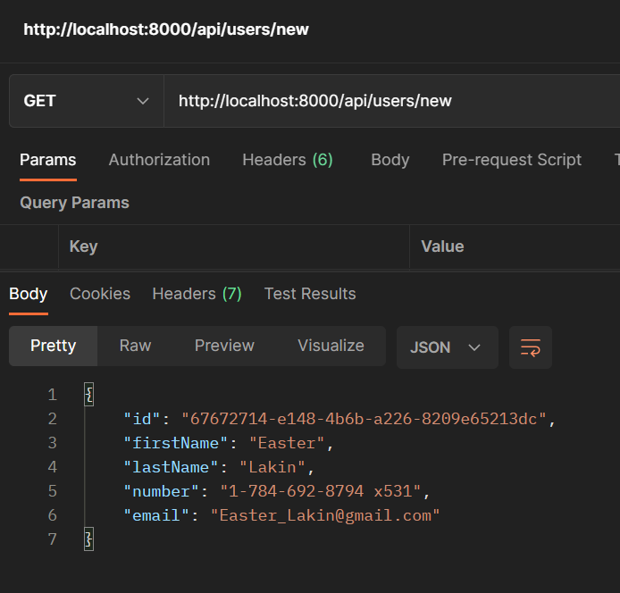
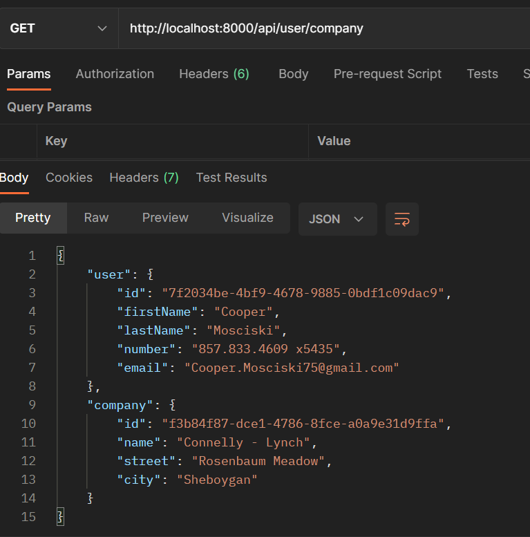

# Fake Api

## Description

let's create an API that generates a random user on a GET request, , the following tasks were done

- Creating an api path "/api/users/new" that returns a new user

- Creating an api path "/api/companies/new" returning a new company

- Creating an api path "/api/user/company" that returns both a new user and a new company

Technologies: node, express, javascript, faker

## Preview

