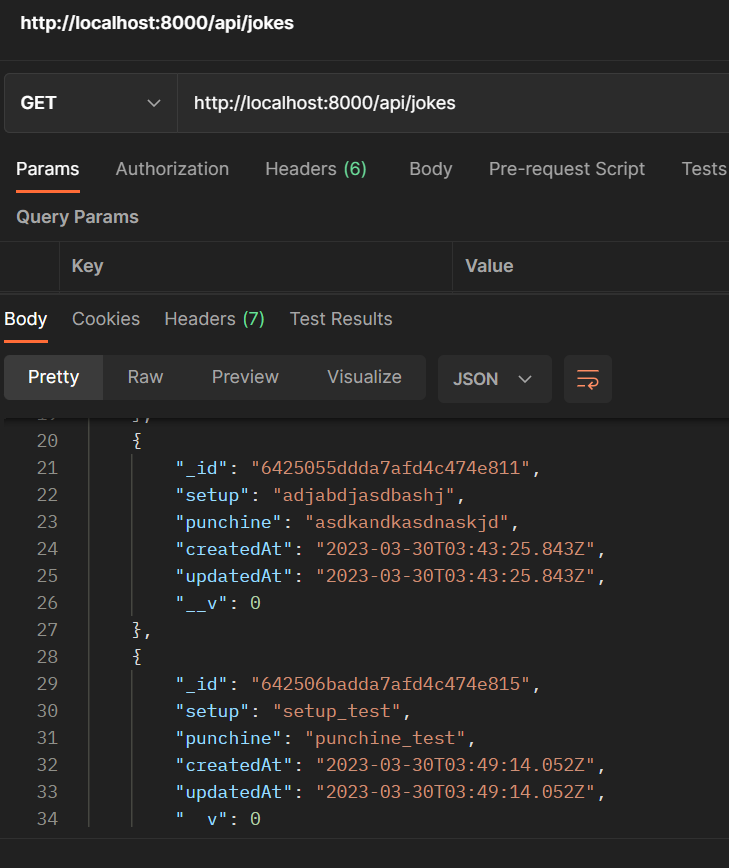
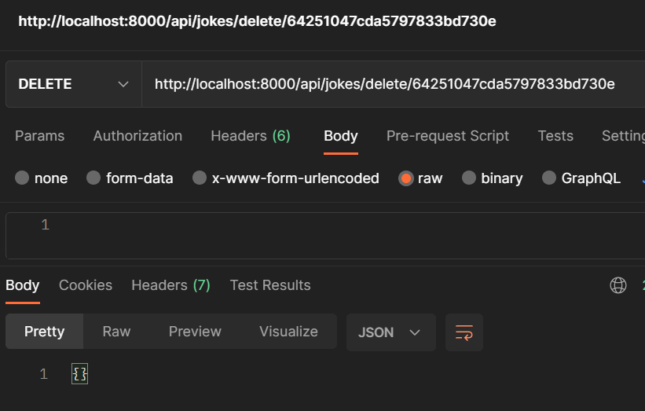

# Jokes Api

## Description:

let's create an API that manipulate a joke, the following tasks were done

- Export a function to get all jokes

- Export a function to obtain a joke

- Export a function to create a joke

- Export a function to update a joke

- Export a function to delete a joke

## Technologies: 

Node, Express, Javascript, Mongodb

## Evidences:

