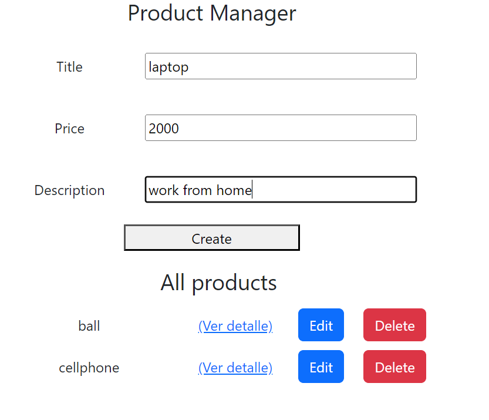
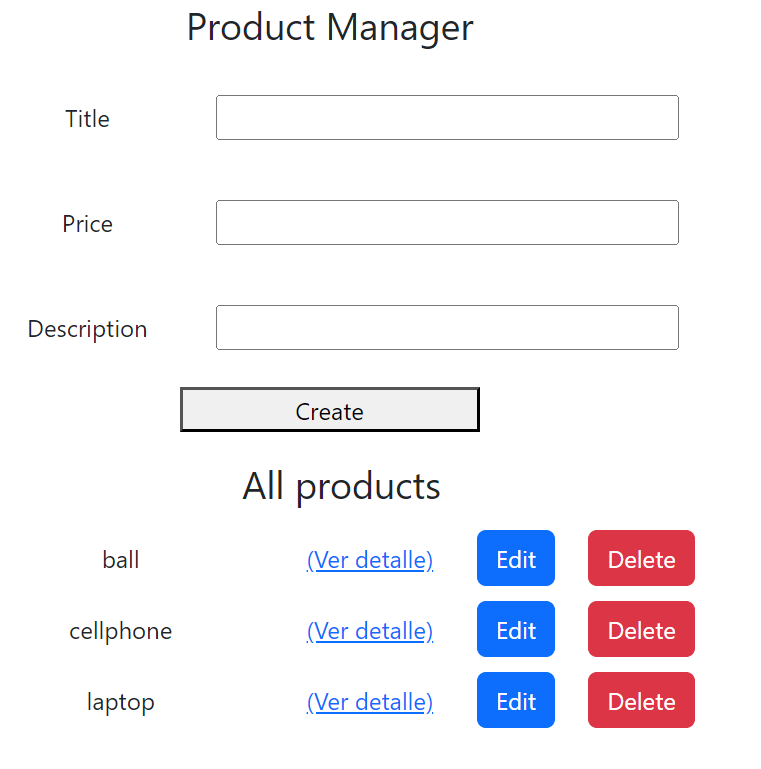
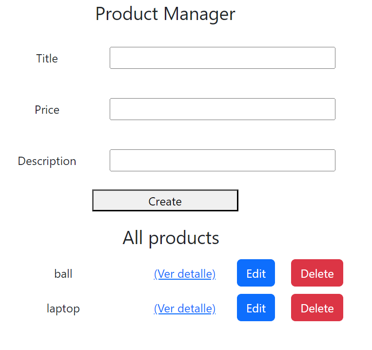
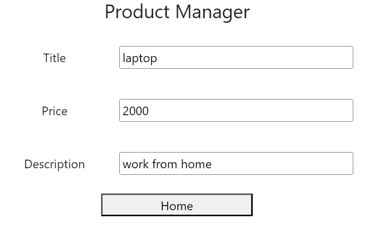
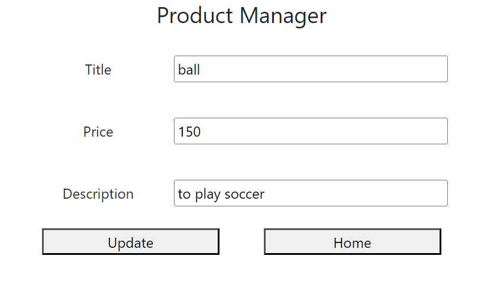

# Product Manager

## Description:

Let's create an application in
where a list of products is shown, where you can also delete, add, update and see details of it

## Technologies:

Node, Express, Javascript, Mongodb, React

## Evidences:

Add a product:

Delete a product:

Product Detail:

Update product information:

