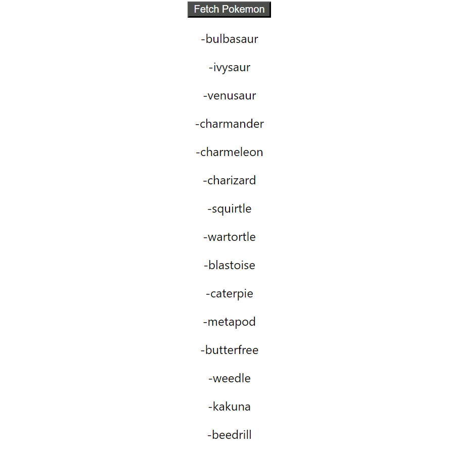

# Pokemon Api

## Description:

This is a simple React project that has a button with the text "Fetch Pokemon".

When this is clicked, it generates the names of all 807 Pokemon using the Pokemon API. (https://pokeapi.co/)

## Technologies: 

React, CSS, Axios, Javascript, HTML

## Preview:

